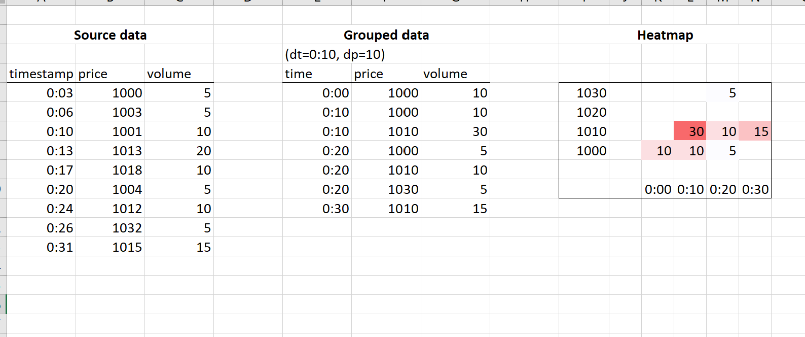

## Challenge

I need two functions in python: to aggregate data and to display a slice of aggregated data as heatmap.

--- Aggregate volume data ---

Input

- pd - pandas dataframe with columns: timestamp, price, volume
- dt - timedelta
- dp - float

Group records according timestamp floored to dt and price floored to pd.

For example, if dt = 0:10, then

- 0:03, 0:05, 0:09 correspond to 0:00
- 0:10, 0:12, 0:18 correspond to 0:10
- 0:21, 0:25 correspond to 0:20 etc.

If dp = 10 then

- 1000, 1003, 1009 correspond to 1000
- 1010, 1015, 1018 correspond to 1010, etc

For each group calculate

- sum of volume in that group

Output
Single dataframe wth columns t, p, v.

--- Display aggregated data ---

Input

- pd - dataframe, output of the previous function
- startTime, endTime - datetime

Output
Records from input dataframe between startTime and endTime inclusive displayed as heatmap with seaborn.

Heatmap should include numeric values of volume in each cell, displayed as integers (i.e. 1023 not '1.023e+3')
If possible, price scale should be linear, i.e. include even missing values (like 1020 on the sample.png attached)

Attached files

1. Sample.png - same logic implemented in Excel
   
2. [Sample.data](sample.dat) - parquet file with input data for the first function
